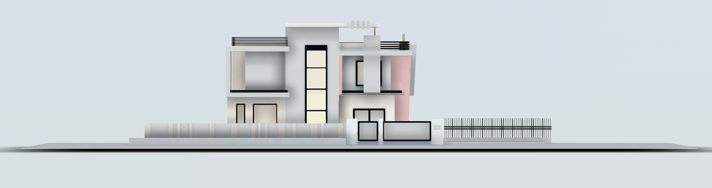

# 🏡 Residential Design Project - Autodesk 3ds Max

Welcome to the **Residential Design Project** repository! This project showcases a detailed and realistic 3D model for a house residency, created with **Autodesk 3ds Max**. Leveraging powerful design techniques and meticulous attention to detail, this model brings architectural concepts to life for residential spaces.

---

## 🌟 Features

- **High-Quality 3D Modeling**: Precision in every element, from layout to intricate details, ensuring an authentic and practical design representation.
- **Realistic Rendering**: Achieved through advanced materials, textures, and lighting for a visually immersive experience.
- **Comprehensive Layout**: Thoughtfully designed to meet residential standards, combining functionality with aesthetics.

---

## 🛠️ Tools & Technologies

- **Autodesk 3ds Max**: Used for creating and refining the 3D model with precision.
- **V-Ray** *(optional)*: For added realism in rendering, providing photorealistic lighting and materials.

---

## 📂 Project Structure

- **Models**: Contains all 3D assets, organized by room and element type.
- **Textures**: High-resolution textures used in the design for added detail.
- **Renders**: Final rendered images showcasing different views and lighting scenarios.

---

## 🔍 Preview
**File_1**

**Image File**

**OR Visit For Full View**

https://viewer.autodesk.com/id/dXJuOmFkc2sub2JqZWN0czpvcy5vYmplY3Q6YTM2MHZpZXdlci1wcm90ZWN0ZWQvdDE3MzA4MDE4MDRfZjRiNWNmMDQtM2NmMS00ZGQyLWE5OTMtZmM4NGIxZTgwOWRjLm1heA?sheetId=YTBhOTdmZmEtMmM0YS00YzA1LWJkYjMtYmZiZTJjMTRiMWE5

**File_2**

**Image File**

**OR Visit For Full View**

https://viewer.autodesk.com/id/dXJuOmFkc2sub2JqZWN0czpvcy5vYmplY3Q6YTM2MHZpZXdlci1wcm90ZWN0ZWQvdDE3MzA4MDE4OTFfZTYzNTkxM2QtOWZkMi00MzM5LTgwY2UtOWM3MWE3MjRlYmQwLm1heA?sheetId=ZmE5Y2VhZDgtYjhkMS00ZDQ0LWFhNTctZWE3ZGUxYmQ4Yjg5

**File_3**

**Image File**

**OR Visit For Full View**

https://viewer.autodesk.com/id/dXJuOmFkc2sub2JqZWN0czpvcy5vYmplY3Q6YTM2MHZpZXdlci1wcm90ZWN0ZWQvdDE3MzA4MDE5MjJfMDFjODNjMTAtNGQ3NS00NmZiLThkZmQtOWE0MDk3YTg2ZDBkLm1heA?sheetId=NGY2Y2U2ZDUtMzkxYy00ZGY1LWJmZDEtZTVmMWJjODRiYjY2

**File_4**

**Image File**

**OR Visit For Full View**

https://viewer.autodesk.com/id/dXJuOmFkc2sub2JqZWN0czpvcy5vYmplY3Q6YTM2MHZpZXdlci1wcm90ZWN0ZWQvdDE3MzA4MDE5NjlfNTgyYWY0YWQtMmZhYi00YjA2LTgxN2YtYTM4ZmQxYzcwNDMyLm1heA?sheetId=ZTNjMmU1NWMtMmQzOS00M2Q1LTg4MDAtMzA5YjMyMjk0NzU1

**File_5**

**Image File**

**OR Visit For Full View**

https://viewer.autodesk.com/id/dXJuOmFkc2sub2JqZWN0czpvcy5vYmplY3Q6YTM2MHZpZXdlci1wcm90ZWN0ZWQvdDE3MzA4MDE5OTBfM2QxYmVhODgtNzhmZC00MzVjLWI2Y2EtMjVhMmE5YmYyYzZmLm1heA?sheetId=YjFmMjA4ODItOWFmZC00NmY5LTgzZTItYTljMThlODgzNmUz

**File_6**

**Image File**

**OR Visit For Full View**

https://viewer.autodesk.com/id/dXJuOmFkc2sub2JqZWN0czpvcy5vYmplY3Q6YTM2MHZpZXdlci1wcm90ZWN0ZWQvdDE3MzA4MDIwMjhfZTEwZWRkZmQtMGY4OS00YzJkLTlhOTItMWMxYjUzNmY4NTFjLm1heA?sheetId=YWVlMjBjYWMtMmExMy00NTIxLTg1YWYtMWRkZjRiYTBiZTdh

**File_7**

**Image File**

**OR Visit For Full View**

https://viewer.autodesk.com/id/dXJuOmFkc2sub2JqZWN0czpvcy5vYmplY3Q6YTM2MHZpZXdlci1wcm90ZWN0ZWQvdDE3MzA4MDIwODhfNjY5ZjFlYjktNDAzNC00ZjlmLTgzMzAtNTIyZjg4MzZkYmZjLm1heA?sheetId=ODYyY2I0YzMtNjU0ZS00MTU3LWE1YWItMGE2MDBlYzk3Y2Rl

**File_8**

**Image File**

**OR Visit For Full View**

https://viewer.autodesk.com/id/dXJuOmFkc2sub2JqZWN0czpvcy5vYmplY3Q6YTM2MHZpZXdlci1wcm90ZWN0ZWQvdDE3MzA4MDIxMjBfZjdhNDQ0MGQtOTgzZi00ZjA1LTkyYzUtOWZhMTYwOWRlMDhjLm1heA?sheetId=MGJkMjNmMWUtNDY5YS00ZTNhLWE5NWQtNDQ0NTM5ZDBjM2Rh

**File_9**

**Image File**

**OR Visit For Full View**

https://viewer.autodesk.com/id/dXJuOmFkc2sub2JqZWN0czpvcy5vYmplY3Q6YTM2MHZpZXdlci1wcm90ZWN0ZWQvdDE3MzA4MDIxMzhfMmI2YWZmMTctOTk1My00MDc2LWFmZWQtMWFiNzA4ZWM1ZDlmLm1heA?sheetId=ZmFhODNkYWEtZDNkNC00OWVlLWIxZGMtYzJjNTExNzExMTM4

**File_10**

**Image File**

**OR Visit For Full View**

https://viewer.autodesk.com/id/dXJuOmFkc2sub2JqZWN0czpvcy5vYmplY3Q6YTM2MHZpZXdlci1wcm90ZWN0ZWQvdDE3MzA4MDIxODhfNzI2ZGQyN2UtMWE2Zi00ZjcwLThlMzctNjczYTAxZGY5ZTYyLm1heA?sheetId=ZjFiNjg2ZjAtYTgxZi00NjcxLWE4OTMtMWEzZDNmMTkxZjNl

**File_11**

**Image File**

**OR Visit For Full View**

https://viewer.autodesk.com/id/dXJuOmFkc2sub2JqZWN0czpvcy5vYmplY3Q6YTM2MHZpZXdlci1wcm90ZWN0ZWQvdDE3MzA4MDIyMThfZTg3ODhiOTUtNGIzOC00NjRhLTkwMzItMzZkM2E3YjZhZjY4Lm1heA?sheetId=MTkxNjkxMTUtOTliOS00NjZmLWIzYWUtNGZmMTA2YWY5MGU4

---

## 🚀 Getting Started

1. Clone the repository.
2. Open the project files in **Autodesk 3ds Max**.
3. (Optional) Enable **V-Ray** settings if rendering with V-Ray.

**OR Download This Project and Open file in Autodesk**

---

## 📄 License

This project is licensed under the MIT License.

---

Thank you for visiting this repository!
